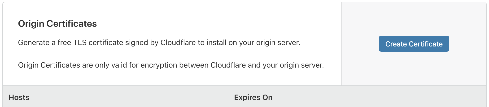

# How to use a Pi as a webserver / server

## What you need

- Raspberry Pi (RPi 4 is preferred)
- Ethernet cable
- Power supply (for RPi)
- SD card
- (maybe) Ethernet switch
- an IPv4 address (doesn't need to be static) or DualStack (IPv6 doesn't work great due to lacking IPv6 coverage)
- ability to do basic port forwarding for a single device (port 80 only)

## General Structure

Cloudflare will be used as a DNS / DynDNS service. From there connections will go through the router, to the raspberry (port 80). Nginx will function as a reverse proxy and proxy everything to where it needs to be (for example docsify, git server (Gogs / gitea), ...). 

## What will be installed?

- nginx (reverse proxy and webserver) and apache2 (for php)
- ddclient for dns updates
- node for web services
- tmux (terminal multiplexer)
- sqlite (for small local database needs) 
- optionally MariaDB (for remote connections)
- optionally Gogs or Gitea as a private git server
- optionally Docsify as a documentation site (can be used for other things like school notes as well)
- optionally Samba as a file server (mostly for accessing / modifiying the website content directly)

## Getting started

Install Raspbian on the SD card, place an empty file named `ssh` in the root directory in order to activate the OpenSSH server automatically (this way, no HDMI cable / monitor is required for setup). Connect ethernet and power and then connect to the pi (the default hostname is raspberrypi, it should be usable to for connecting, if not look up the IP address of the pi in the router).
Set the hostname of the pi to something more useful if you want to (maybe a fancy name or just "rpi3", "rpi0", ...). Giving the pi a name inside the router is also a good idea since this name can most probably be used to connect to the pi over ssh (`ssh user@rpi3`).

Set up a user and set passwords for root and the new user, maybe create users for specific things like a samba server or MariaDB as well if needed.

## Installing things

To install software use the included `install_*.sh` files. They contain the commands to install most things like for example apache or sqlite. Some things may require, depending on device, somewhat different installation steps, such as tmux (at least when a relatively new version is needed). This will be indicated by having multiple files.

### libs

The `install_libs.sh` script installs many often needed libraries. Running this first is a good idea since other scripts might have a problem if for example ncurses or libevent are missing.

Also running apt-get update and apt-get upgrade often is a good idea. The script does this once at the start and this might take a long time (can take 30 minutes depending on how much needs to be updated). 

### tmux

Tmux is a terminal multiplexer which makes using the terminal way easier with multiple panes and windows and other fancy stuff.

Installing tmux can sometimes be annoying on older (arm) devices such as older raspberries or the raspberry pi zero. To get a new version on the raspberry pi zero for example it is required to build from source. To do this just run the `install_tmux_armv6.sh` script, but keep in mind that the `install_libs.sh` script needs to be run previously since it installs some needed dependencies. When the `./configure` command fails for some reason try looking at what made it fail (it is checking for required dependencies and finding what is missing is easy) and install / fix the missing dependency.

The scripts (`install_tmux.sh` and `install_tmux_armv6.sh`) both download a tmux configuration which might have some errors duo to using a different tmux version than that of the tmux configuration file (tmux@2.6). To fix this either edit the file directly and remove or fix the error generating configuration lines or just create a new `.tmux.conf` file and maybe keep some things from the old file that were good and didn't generate errors.

### nginx and apache2

Basically just run the `install_webservers.sh` script. Installing these both is incredibly easy, no weird install steps, just apt-get install. 

The configuration files for nginx are located at `/etc/nginx` (use the file `/etc/nginx/sites-available/default` or create custom files (the later is generally seen as the more professional solution but it does not really matter since using the default does not really make things more difficult or something like that)). 

Similar to nginx the configuration files for apache2 are located at `/etc/apache2`. Just have a look around and decide what to change.

At some point you have to decide if you want to use apache for php or not, if you want to, then you have to configure that and set a port for apache to use. If you still want nginx as a reverse proxy set a port different than 80 and configure nginx to proxy to this port. If you don't want nginx then set the port for apache2 to 80.

Both apache2 and nginx can be used as reverse proxies, but personally I think that nginx does it a bit better and is easier to configure.

### node

NodeJS is useful for many things web related. Many services are build with node, that is why having it is pretty important. Also personally I think for developing services node is pretty nice. The `install_node.sh` script installs a recent version of NodeJS, not an outdated version as could be installed using apt.

### ddclient

ddclient is a tool for automatically updating dynamic DNS servers. It runs at regular configured intervals, checks what your current IP address is and sends it to the DynDNS server to update it there. It is important to download the 3.9.0 version in order to have Cloudflare support, since Cloudflare uses their own "protocol" (the protocol is just a specific REST API endpoint that has to be called with the new IP address) which is not included in older ddclient versions.

Use the `install_ddclient` script to install ddclient 3.9.0.

### sqlite

Sqlite3 is a small file based SQL database that is great for smaller projects since it is file based and comes without many of the more complicated database features such as users and permissions. Ultimately you probably want to use a "real" database solution once the project gets to a pretty large size, but sqlite is good for a long time and is hassle free unlike other databases. For rather low-level things sqlite is great, even at scale. Many android apps, as well as low-level applications use sqlite as a local database making it the most widely used database (this is rather similar to linux being the most used operating system, you don't really notice linux anywhere but it is still used everywhere).

### MariaDB

Use the `install_mariadb.sh` script to install MariaDB. When installing setting a password for the root user is required, using a password manager to generate & save this password is recommended.

After the installation is complete access to the database can be done through `mysql -u root -p`. When prompted for the root password enter the previously entered root password. Using a non-root account is of course recommended.

These links should show how adding and removing users works
- [mariadb.com - create-user](https://mariadb.com/kb/en/library/create-user/)
- [tableplus.io - mariadb-how-to-create-new-user-and-grant-privileges](https://tableplus.io/blog/2018/09/mariadb-how-to-create-new-user-and-grant-privileges.html)
- [daniloaz - how-to-create-a-user-in-mysql-mariadb-and-grant-permissions-on-specific-database](http://www.daniloaz.com/en/how-to-create-a-user-in-mysql-mariadb-and-grant-permissions-on-a-specific-database/)

### git server (Gogs / Gitea)

Gogs is a standalone git server and Gitea is a fork of Gogs.

#### Gogs

> Having MariaDB set up is required for this to work. Optionally sqlite can also be used.

To install Gogs use the `install_Gogs.sh` script and then follow the configuration steps in the browser. The script creates a new user called `git` which will be the user Gogs uses. It then downloads Gogs, unzips it, moves it to the git home directory. It will prompt for the root database password and then create a new database user named Gogs (and prompts for a password) and a `Gogs` database. After that it starts Gogs. Open `<hostname>:3000/install` to configure Gogs. Enter the database user and password (Gogs and the previously entered). 

The directory structure of Gogs is as follows

```
Gogs
|> Gogs (executable)
|> scripts (Gogs build / ... scripts; better not touch)
|> custom (for adding certain things yourself; does not exist by default)
|  |> conf
|  |  |> locale (changing / adding translations (locales))
|  |  |> app.ini (config file) 
|  |> templates
|     |> inject (.tmpl files to inject)
|> public (webapp assets / resources)
|  |> assets
|  |> css
|  |> img
|  |> plugins (jQuery, ...)
|> templates (html templates)
|  |> admin
|  |> base
|  |> explore
|  |> inject
|  |> mail
|  |> org
|  |> repo
|  |> status
|  |> user
|  |> home.tmpl
|  |> install.tmpl
```

You can add things inside `custom/templates` and if needed modify things inside the normal `templates/` directory. Also adding a new css file or similar to the `public` folder is also possible. Generally don't touch the `scripts` folder and don't touch the `app.ini` unless you know what you are doing (If you decide to edit the config file, take a look [here](https://Gogs.io/docs/advanced/configuration_cheat_sheet) for documentation). 

Incase you want a mobile friendly and otherwise also improved Gogs copy the changes (unchanged files (in `templates/`) are also in here, meaning you should be able to just replace the templates folder completely) from [here](https://github.com/JannikWibker/Gogs-reskin) into your Gogs installation.

### docsify

Docsify is a "magical documentation site generator" ([docsify.js.org](https://(docsify.js.org))). Basically it takes a directory with markdown files and creates a nice website around it with sidebar, markdown rendering, themes and all that fancy stuff. I personally use docsify (but heavily modified to fit my needs) as a site for school related notes and scripts (everything behind a login so no self-promoting example link). Docsify does not need to be used for documentation, my personal usecase is not even close to documentation, it can be used as something similar to a wiki (just without online editing, only locally through files or git (or samba)).

Docsify has a plugin system and there are many plugins available. Searching npm for plugins works great. I created a pretty customized version of docsify with a few normally available plugins, a few self written plugins and a few modified plugins. It is available on [GitHub](https://github.com/JannikWikber/example-docsify-config). Included is a dark mode, better sidebar, optimized directory structure for many files, generatable qr codes for files to easily share and finally [KaTeX](https://katex.org) support.

> Note: this docsify version uses my personal cdn server, if this is not wanted download all the files that are being used by the index.html file and save them locally under `/static`.
> 
> Note: Creating favicons and similar is required as there are non included. A full list of what needs to be created can be found in the [repository](https://github.com/JannikWibker/example-docsif-config) ([realfavicongenerator](https://realfavicongenerator.net/) is a nice site to create all of these).

Docsify is completely static, meaning it does not need a backend, just an apache, nginx or other webserver. `serve` is a good node-based webserver. It will (later (nginx configuration)) be assumed that docsify runs on port 5000, how exactly is not important.

### Samba

Samba is the Linux-port of the SMB Protocol (created by Microsoft). This allows easy sharing and changing of files (such as webserver content). Using samba-shares makes it easy to update content displayed on site(s).

Installing Samba is not hard, what may be hard is configuring everything correctly and getting everything to work out fine. Especially permissions can be somewhat annoying to deal with when using samba since a simple "you can do everything"-solution is as easy as setting a single value. Actual directory permissions as well as permissions inside the configuration of the share need to allow that.

One thing that definitely needs to be done is creating samba users / setting passwords for users. This is done through the command `smbpasswd`:

```sh
smbpasswd -a <user>
```

Once users are created / have passwords it's time to create a share. This is done inside the samba config file located at `/etc/samba/smb.conf`.

To add a share scroll to the end and add the share as follows:

```ini
[<share name>]
comment = <share description>
path = <path to share>
follow symlinks = yes
wide links = yes
browseable = yes
writeable = yes
admin users = <list of admin users (comma seperated)>
valid users = <list of valid users (comma seperated)>
create mask = 0777
directory mask = 0777
```

Make sure the directories have their permissions set right. The users that will be using the share should have access to reading / writing to the directories.

Another important thing to know is how to restart samba. Restarting does not work like other services / daemons via systemctl or similar. It has to be done through init.d:

```sh
/etc/init.d/samba restart
```

> Note: [samba: set up a raspberry pi as a file server for your local network](https://www.raspberrypi.org/magpi/samba-file-server/)

It might also be a good idea to limit the access to the samba server itself. Samba allows restricting access to certain networks (such as your local network). Even when the proper ports are not forwarded it might be a good idea to configure this anyway just to be safe.

```ini
[global]
hosts allow = <local network address and subnetmask (i.e. 192.168.1. 127.)>
workgroup = <windows workgroup>
wins support = yes
```

> Note: Using the `smbtree -U <user>` command you can scan your local network for available SMB shares that can be accessed by the given user. 

## Domain stuff

### Getting a domain

There are some free TLDs such as .ml, .ga, .gq, .cf and .tk. Normally when seeing .cf or .tk my gut reaction is "oh thats probably spam / a virus". But .ml, at least for me, does not have this negative connotation, it could mean something hip, "cool" and buzz-wordy such as "machine learning". Thereby I'd advise to use .ml since it does not make one look as unprofessionell as other free TLDs do. [Freenom](https://freenom.com) has all the above mentioned TLDs for free (as long as the domain is not super short or is a common word found in a dictionary (for example notes.ml would probably cost money)).

Other paid domains can of course be used aswell.

### Dynamic DNS

Cloudflare can be used as a dynamic DNS and allows CNAMEs and other fancy DNS stuff and also allows using your own domain. Alongside all the other cool features Cloudflare offers this basically makes Cloudflare the perfect solution for DynDNS.

Make a free account with Cloudflare and go through the Setup process for your new domain, select the free plan and copy the 2 DNS server domains that Cloudflare gives you. Enter them on [freeonom](https://freenom.com) or where ever you have your domain located. It may take some time before everything "synchronizes" and works out duo to how DNS works (DNS things can take up to 24h, but are usually a lot faster (maybe 5min - 2h)). After that complete the Cloudflare setup and get your Cloudflare API key which is needed for ddclient.

Inside Cloudflare DNS records can be created somewhat freely. A, AAAA, CNAME, MX, TXT, NS, and many more types of records can be used. Cloudflare only allows one layer of subdomains / CNAMEs (Cloudflare does something called "CNAME Flattening"), this means that things like `api.application.domain.tld` won't work, but things like `api-application.domain.tld` will work.

Create a A record and enter your current public IP address (this process will later be automated via ddclient). Then create as many CNAME records as you want with the wanted subdomain as "Name" and an "@" as "Domain name". The `@` is a synonym for the current domain. This means that `subdomain.domain.tld` will point to `domain.tld`. This might seem to be wrong at first sight, but the idea behind this is that everything is sent to the Pi, then processed by nginx and reverse proxied to the correct application / service depending on subdomain. So the "routing" is done directly on the Pi and not on DNS level.

This is how the DNS records might look for you.

```
Type   Name         Value
-----  -----------  -----------------------
A      <domain>     points to <ip>
CNAME  <subdomain>  is an alias of <domain>
CNAME  <subdomain>  is an alias of <domain>
CNAME  <subdomain>  is an alias of <domain>
```

Make sure to turn on SSL and if possible try using Origin Certificates. Other things such as "Auto Minify" are also great, just take a look around and read the "Help"-sections below each feature. 

### ddclient

ddclient needs to know when and what to send to where. This has to be done through a config file located at `/etc/ddclient/ddclient.conf` (for older versions of ddclient it may be located at `/etc/ddclient.conf`).

```ini
daemon="<time intervals in seconds (1800 / 3600)>"
protocol="<protocol (clouflare)>"
use=web
web="<service to get public ip address (ifconfig.me/ip)>"
syslog=yes
cache="<path to cache file (/tmp/ddclient.DOMAIN.cache)>"
ssl=yes
login="<username / email for dyndns provider (email for Cloudflare)>"
password="<password / token for dyndns provider (Global API Key for Cloudflare)>"
zone="<DOMAIN>"
<DOMAIN>
```

## Networking stuff

### Nginx as a reverse proxy

Previously it was explained that different files could be used for nginx, either the default configuration file or specifically created ones under the `/etc/nginx/sites-available/` directory. This fact won't be mentioned again. It is pretty much unimportant which file you choose, the things inside the file are what matters, so that will be the focus.

Let's assume that the following subdomains have been created and have the following purpose:

- **`www.`**: The same as just the default domain; A basic static website
- **`git.`**: Gogs / Gitea installation (running on port 3000)
- **`docs.`**: Docsify (running on port 5000)

Lets also assume that the domain is `example.ml` (this is a special use reserved domain name (every example. domain is a special use reserved domain, see [RFC6761](https://tools.ietf.org/html/rfc6761) and [IANA - special use domain names](https://www.iana.org/assignments/special-use-domain-names/special-use-domain-names.xhtml)) and can thereby be used for documentation / example purposes but cannot be globally routable (only example.com, example.org and example.net are globally routable)).

First of all comment out anything that might already be in the file or delete it. The configuration is not complicated and the few things that are already inside can easily be recreated.

For the basic website (which will be running under example.ml and www.example.ml) either proxy it to apache2 or use nginx itself. When using apache2 make sure to change the default port from 80 to something else (and from 443 to something else too). These ports will be occupied by nginx. 

For each subdomain / service create new server blocks and add a `server_name`-entry with all the domains that will redirect there (separated by spaces, **not** commas). As well as that add two `listen`-entries with the port to listen on (one of the ports has to be prefixed with `[::]:` for IPv6 support, that's also why 2 entries have to exist). The first entry also gets a `default_server` after its listen entries. Optionally add 443 as a port as well if HTTPS/SSL/TLS support is needed. Here's where Cloudflare Origin Certificates become useful.

```
# www.example.ml, example.ml
server {
  listen 80 default_server;
  listen [::]:80 default_server; # [::] is the ipv6 equivalent of 0.0.0.0
  # listen 443 ssl default_server; # optional ssl
  # listen [::]:443 ssl default_server; # optional ssl but ipv6
  server_name www.example.com example.com;
}

# git.example.ml
server {
  listen 80;
  listen [::]:80;
  # listen 443;
  # listen [::]:443;
  server_name git.example.ml;
}

# docs.example.ml
server {
  listen 80;
  listen [::]:80;
  # listen 443;
  # listen [::]:443;
  server_name docs.example.ml;
}
```

Then after that add `location`-blocks. These will decide what to do with the incoming requests. For static content also add a `root`-entry outside the location block.

```diff
  # www.example.ml, example.ml
  server {
    listen 80 default_server;
    listen [::]:80 default_server; # [::] is the ipv6 equivalent of 0.0.0.0
    # listen 443 ssl default_server; # optional ssl
    # listen [::]:443 ssl default_server; # optional ssl but ipv6
    server_name www.example.com example.com;
+   
+   root /path/to/static/content; # often /var/www/html
+   
+   location {
+     try_files $uri $uri/ /index.html; #
+     # this complete location block can be omitted if only direct file access should be allowed
+   }
  }

  # git.example.ml
  server {
    listen 80;
    listen [::]:80;
    # listen 443;
    # listen [::]:443;
    server_name git.example.ml;
+   
+   location {
+     proxy_pass http://localhost:3000;
+   }
  }

  # docs.example.ml
  server {
    listen 80;
    listen [::]:80;
    # listen 443;
    # listen [::]:443;
    server_name docs.example.ml;
+   
+   location {
+     proxy_pass http://localhost:5000;
+   }
  }
```

In case you want custom logging you can specify a log format and file for each server block. Specifying a global log format is also possible.

```diff
+ log_format cf '[$time_local] $request ($status) - $request_time - $http_x_forwarded_for $remote_addr $server_port ($http_user_agent) $http_cf_ipcountry - $body_bytes_sent - $gzip_ratio - $http_cf_ray';

  # www.example.ml, example.ml
  server {
    ...
    server_name www.example.com example.com;
+   
+   real_ip_header X-Forwarded-For;
+   
+   access_log /var/log/nginx/ml.example.www.log cf;
+   
    ...
  }

  # git.example.ml
  server {
    ...
    server_name git.example.ml;
    
+   
+   real_ip_header X-Forwarded-For;
+   
+   access_log /var/log/nginx/ml.example.www.log cf;
+   
    location { ... }
  }

  # docs.example.ml
  server {
    ...
    server_name docs.example.ml;
+   
+   real_ip_header X-Forwarded-For;
+   
+   access_log /var/log/nginx/ml.example.www.log cf;
+     
    location { ... }
  }

```

> `real_ip_header X-Forwarded-For;` gets the ip address from the X-Forwarded-For header (which cloudflare sets to the users ip address) and sets it as the source ip address. Since all source ip addresses are those of Cloudflare servers since Cloudflare proxies the traffic trough them the original source ip address needs to be recovered if logging should include (real) source ip addresses.

### Origin Certificates

Cloudflare offers something called **Origin Certificates**. The connection from the client to Cloudflare is already encrypted and uses https / TLS / SSL, but the connection from Cloudflare to your server (/ pi) is not encrypted. That’s where Origin Certificates come into play, they are certificates used to encrypt the connection between Cloudflare and your server. Cloudflare generates the certificates and all you have to do is configure nginx to use them.


First the certificates have to be generated. This is done inside the Cloudflare web interface (it can also be done through the Cloudflare API if this is needed). In the web interface go to the **Crypto**-tab and go to **Origin Certificates**.



Click on *Create Certificate*, choose either `RSA` or `ECDSA` (Elliptic Curve Digital Signature Algorithm) and choose an expire time (the maximum (and also default time) is 15 years) and click *OK*.

**SAVE THE CERTIFICATE AND KEY** as it will only be shown once. Put these two files on the server inside the `/etc/nginx/ssl/` directory. Preferably name them `<domain>-tld-cert.pem` and `<domain>-tld-key.pem` respectively. 

Since SSL works over port 443 instead of port 80 you have to add `listen`-entries for port 443.

```
listen 443 ssl http2;
listen [::]:443 ssl http2;
```

This can either be added to the global scope (outside of every server block) or inside every `server`-block that is applicable. In addition to that the paths to the certificates have to be added.

```
ssl on;
ssl_certificate     /etc/nginx/ssl/<domain>-cert.pem;
ssl_certificate_key /etc/nginx/ssl/<domain>-tld-key.pem;
```

> If the version of nginx is higher or equal than 1.15.0 then the `ssl on;`-statement can be omitted.

Now restart nginx using `systemctl restart nginx`. If that fails take a look at `systemctl status nginx` and look where it failed.

That’s it, now Cloudflare will use HTTPS to connect to your server instead of HTTP. 
